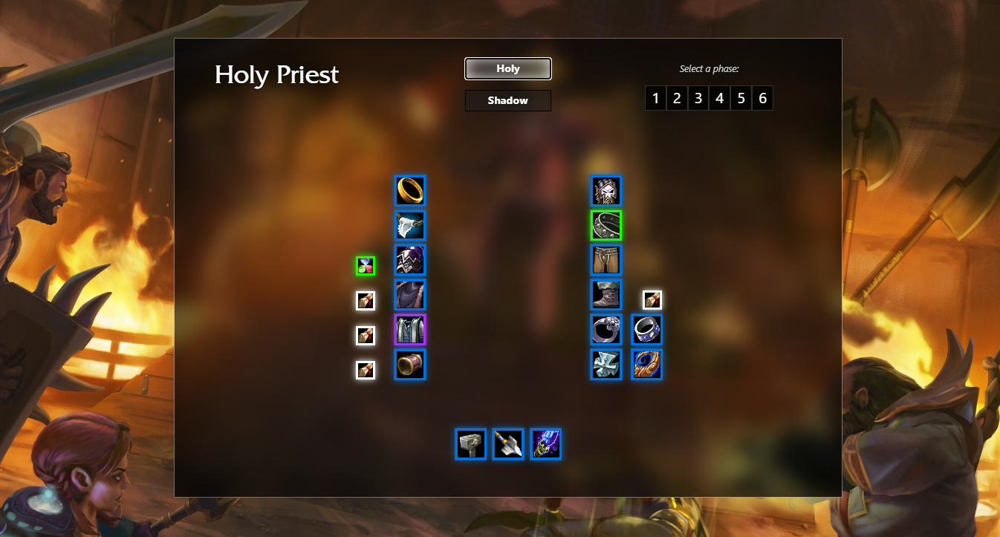

# World of Warcraft DB

In anticipation for Season of Mastery 2, I decided to build a modern, streamlined web application for BiS items.

<hr/>


<hr>

## FAQ:

- <i>What is Season of Mastery?</i>

  <strong>Season of Mastery is a specific version of the video game World of Warcraft. Essentially, it is the original version of the game from 2005, but with some changes like increased difficulty, faster leveling, etc.</strong>

- <i>What does "BiS" mean?</i>

  <strong>"BiS" stands for "Best in Slot". Part of the fun of World of Warcraft is trying to get the best gear/items in the game. This web app aims to make it easier for players to track what those "Best in Slot" items are.</strong>

- <i>What are phases?</i>

  <strong>When Blizzard launches new ("fresh") servers, they do not release all of the content immediately. Instead, they release content in waves, or phases. This content comes in the form of raids, dungeons and more. Here is a list of some of what each content phase has in store:

    <ul>
    <li>Phase 1 - Molten Core, Onyxia's Lair</li>
    <li>Phase 2 - World Bosses, Honor System</li>
    <li>Phase 3 - Blackwing Lair, Darkmoon Faire</li>
    <li>Phase 4 - Zul'Gurub, Arathi Basin</li>
    <li>Phase 5 - Ruins & Temple of Ahn'Qiraj</li>
    <li>Phase 6 - Naxxramas, Scourge Invasion</li>
    </ul>

</strong>

<hr>



<hr/>

## Built With

- React
- Bootstrap
- MySQL
- Node.js
- Express
- ❤️

###### I literally just started building this application, so... if you're reading this, you're pretty early. Like, a little _too_ early... _hmm..._

<hr/>

## Installation

```bash
npm i
npm run dev
```

## Contributing

Pull requests are welcome. For major changes, please open an issue first
to discuss what you would like to change.

Please make sure to update tests as appropriate.

## License

[MIT](https://choosealicense.com/licenses/mit/)
