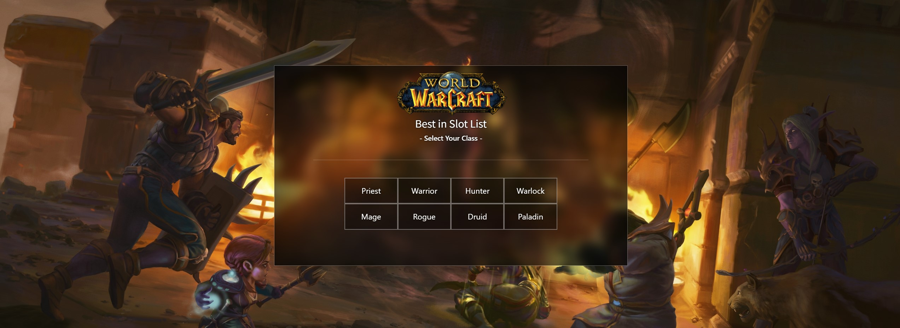

# World of Warcraft DB

This is a database for BiS items in World of Warcraft: Classic (2005)



###### I literally just started building this application, so... if you're reading this, you're pretty early. Like, a little _too_ early... _hmm..._

<hr/>

## Built With

- React
- Bootstrap
- MySQL
- Node.js
- Express
- ❤️

<hr/>

## Installation

Literally just an express server at the moment, so just run the following:

```bash
npm run dev
```

## Contributing

Pull requests are welcome. For major changes, please open an issue first
to discuss what you would like to change.

Please make sure to update tests as appropriate.

## License

[MIT](https://choosealicense.com/licenses/mit/)
